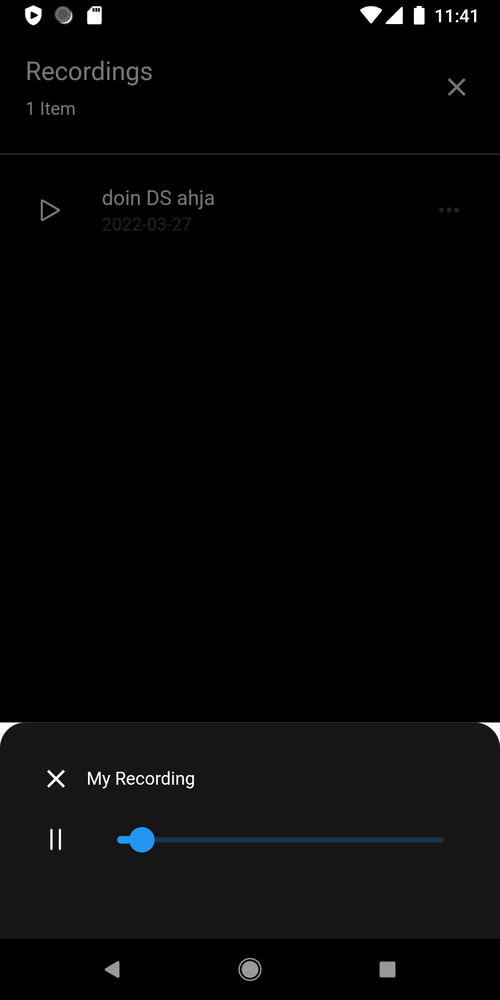

# Food Delivery UI.
A food delivery UI, built with flutter.

## Tools
- record `library for recording`
- provider `state-management`
- premissiom_handler `Requesting permissions for both platforms`
- path_provider `For downloading recorded files to the phone`
- flutter `v2.5.0 - mobile sdk`

<!-- 
 -->

