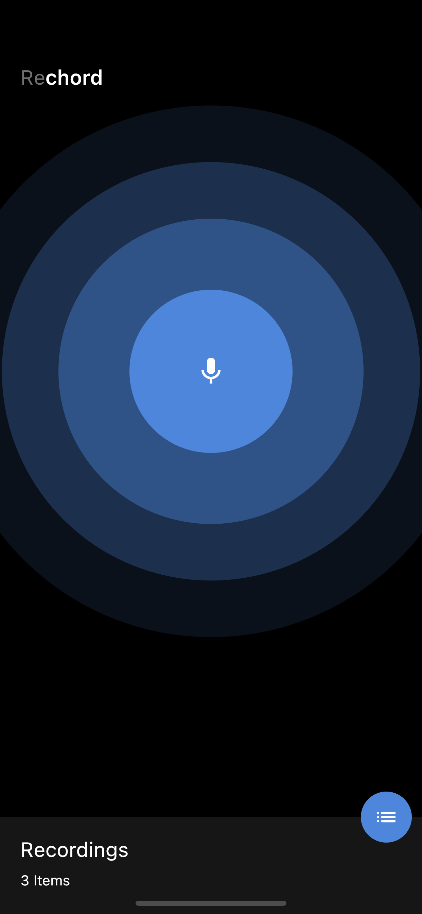

# Rechord.
A flutter application that allows you record audio/sound.

## Tools
- record `library for recording`
- flutter_riverpod `state-management`
- hooks_riverpod `Easy Use of Statemanagement`
- path_provider `For Locating Paths in user's device`
- flutter_secure_storage `Caching of recorded files`
- intl `Formatting of DateTime`
- flutter `v2.5.0 - mobile sdk`

